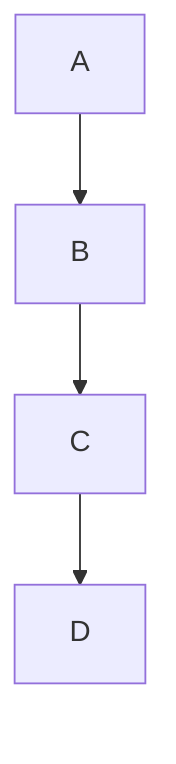

# Markdown 要素一覧
## 見出し
# 見出し1
## 見出し2
### 見出し3
#### 見出し4
##### 見出し5
###### 見出し6

---

## テキスト装飾

**太字**  
*斜体*  
~~取り消し線~~  
`インラインコード`

### 組み合わせ

**_太字かつ斜体_**  
***太字と斜体***  

---

## リスト

### 番号なしリスト:
- アイテム1
- アイテム2
  - サブアイテム1
  - サブアイテム2

### 番号付きリスト:
1. 項目1
2. 項目2
   1. サブ項目1
   2. サブ項目2

### チェックリスト:
- [x] 完了した項目
- [ ] 未完了の項目

---

## 引用

> これは引用です。
>> 二重引用です。

---

## コードブロック

```
console.log("Hello, World!");
```

```javascript
function greet() {
  console.log("Hello, World!");
}
```

```html
<div>
  <p>HTMLの例</p>
</div>
```

---

## テーブル

| 見出し1 | 見出し2 | 見出し3 |
|---------|----------|----------|
| データ1 | データ2 | データ3 |
| データ4 | データ5 | データ6 |

---

## リンク

[Google](https://www.google.com)

---

## 画像


---

## 水平線

---

---

## 定義リスト

項目1  
: 説明1

項目2  
: 説明2

---

## 折りたたみセクション  {#12}

<details>
  <summary>クリックして展開</summary>
  展開された内容
</details>

---

## 数学式

```math
E = mc^2
```

$$
\frac{a}{b} = c
$$

---

## HTML挿入

<p>これはHTMLで記述した段落です。</p>

---

## コメント

<!-- これはコメントです -->

---

## タスクリスト

- [x] 完了タスク
- [ ] 未完了タスク
- [ ] 進行中のタスク

---

## 絵文字

😃 😢 🎉 🚀

---

## 脚注

これは脚注の例です[^1]。

[^1]: これは脚注の内容です。

---

## アンカーリンク

[戻る](# 見出し1)

---

## 改行

改行するには、末尾に2つのスペースを入れます。  
次の行です。

---

## 特殊文字のエスケープ

\* \_ \` \[ \] \( \)

---

## インラインHTML

<div style="background-color: #f0f0f0; padding: 10px;">
  <p>背景色を設定したHTMLブロック</p>
</div>

---

## 複数レベルの折りたたみセクション

<details>
  <summary>レベル1</summary>
  <details>
    <summary>レベル2</summary>
    <details>
      <summary>レベル3</summary>
      レベル3の内容
    </details>
  </details>
</details>

---

## グラフ・チャート



---
